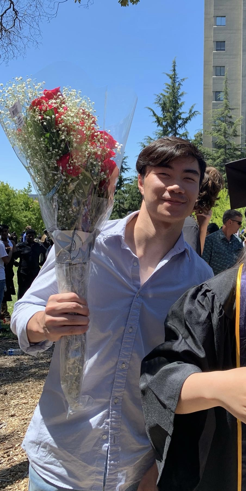

# Danny's  User Page

## Intro
*Hello, Internet.* I am **DANNY**. Welcome to my ***user page***. ~~Please forgive all this unnecessary text styling.~~ And this<sup>superscript text</sup> and this<sub>subscript text</sub>.  

## Quoting
To quote text:
> I am **DANNY**  

To quote code:  
In a line I can write `print("Yo")` and for a block:
```
print("I am DANNY")
```
I can also call out colors with `rgb(9, 105, 218)` and `#0d1117`.

## Links
I can also add links to other wedsites like [Github Pages](https://pages.github.com/).

And section links: 
[Intro](#intro) [Quoting](#quoting) [Links](#links) [Images](#images) [Lists](#lists)

And relative links to other files! For one in this repository: [README](./README.md)


## Images
I can also display an image with:  
Relative Link:  
  

Resize it with:  


Absolute link:  


## Lists  
I can also create lists.  
Unordered lists:  
- Trolley
- Bus
- Car if you have pass (A or B, not D do not get bamboozled)
- Scooter but no swag

Ordered Lists:  
1. Find out how to survive (Difficulty may vary)
2. Get knowledge
3. Get skills
4. Get job
5. Figure out how to what is money and how to spend it
    - Optional, figure out how to earn money better.
        - Also optional, figure out how to save money
6. Get money
7. Figure out what to spend extra money on
. Spend extra money
8. Check if you're happy. If happy, continue. Else, restart at 4.
9. Die


Task Lists:  
- [x] Wake up
- [ ] Finish this
- [ ] Watch CSE 140 and 140L lectures
- [ ] Do CSE 158 assignment 1
- [ ] Check mental health. If ok, continue. Else, decide which to drop
- [ ] Hopefully pass this quarter  :+1: :shipit: